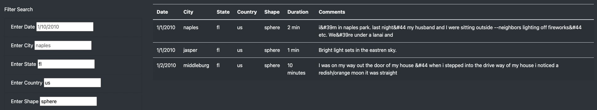
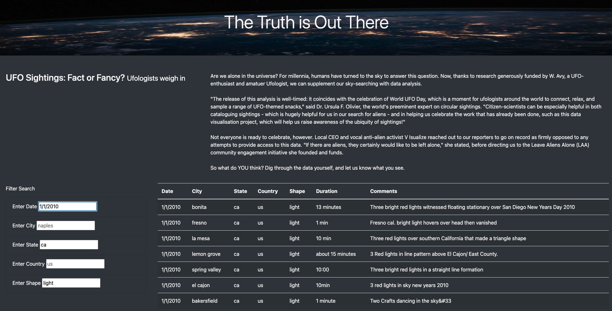

# UFO-Finder.github.io
Github Live Version of UFO Finder Module 12 Challenge

## Overview of the analysis:
  - Dana wants to build a webpage with a dynamic table that allows users to filter for multiple criteria in one search. The users will be able to search by date, city, state, country, and shape. 
  - Using HTML, CSS, and JS we can build this table by adding the additional filters in HTML then adding multiple functions to iterate through the user inputs using JS. 

## Results:

### Describe to Dana how someone might use the new webpage by walking her through the process of using the search criteria. Use images of your webpage during the filtering process to support your explanation.

  - In order to use the webpage the user must enter lower case and exact values for the table to return results. The user is able to enter up to 5 filters for the search. If there is not an exact match the table will return empty, the user should remove some constraints and try again.
  
  - For Example: The user could enter 'fl' for the State Filter, enter 'us' for the Country Filter, and 'sphere' for the Shape Filter. As shown below, there are 3 sightings of UFO's matching the criteria [ State: 'fl' , Country: 'us' , Shape: 'sphere' ].

- Another Example: The user could enter '1/1/2010' for the Date Filter, enter 'us' for the State Filter, and 'light' for the Shape Filter. As shown below, there are 7 sightings of UFO's matching the criteria [ Date: '1/1/2010' , State: 'ca' , Shape: 'light' ].

## Summary:

### The summary addresses one drawback of this webpage:
  
   - The user needs to enter lowercase letters. If they do not, the search will not return the intended result as it is case sensitive. 
    
### The summary addresses two additional recommendations for further development:

   - I think the code should automatically change the user input within javascript in order to lowercase to avoid case sensitivity. This also could be done for states to handle both abbreviations and the full state name ( NY and New York ). 
   - Using google mapping API's I think it would be useful to pull the location from the table and display them on an interactive map within the web page. For example, a person would look up specific data and see where those UFO sightings occurred relative to one another on a map. 
